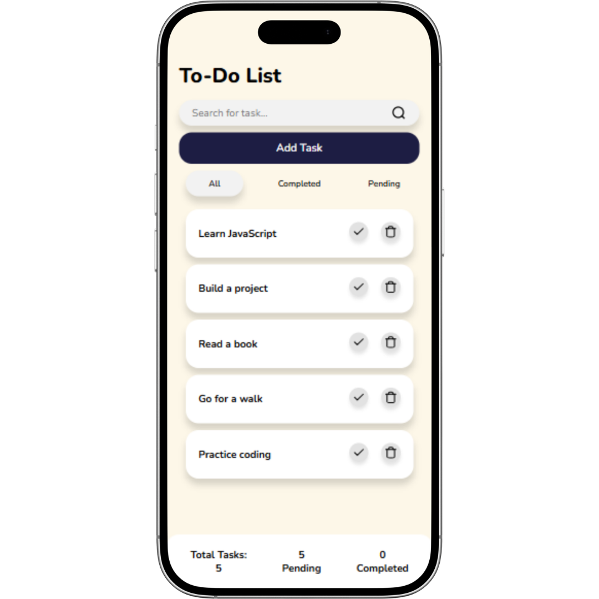

# To-Do List

A clean, responsive **React To-Do List application** for managing daily tasks with search, filtering, completion tracking, and task deletion.

## 🚀 Live Demo

**Try the application:**
https://joshuaprashanth.github.io/To-Do/

## 📸 Screenshot



> **Note:** Add your application screenshot to the project root and name it `screenshot.png`. The image will then appear automatically in this README.

## ✨ Features

- ✅ Add new tasks
- 🔍 Search tasks
- ✔️ Mark tasks as completed
- 🗑️ Delete tasks
- 📋 View all tasks
- ✅ Filter completed tasks
- ⏳ Filter pending tasks
- 📊 Display total, pending, and completed task counts
- 🔄 Restore the original task list after searching
- 📱 Fully responsive design
- 💻 Optimized for desktop, tablet, and mobile screens
- 🎨 Clean and minimal user interface
- ⚡ Fast and lightweight React application

## 🛠️ Tech Stack

| Technology            | Purpose                       |
| --------------------- | ----------------------------- |
| **React.js**          | Building the user interface   |
| **JavaScript (ES6+)** | Application logic             |
| **CSS3**              | Styling and responsive design |
| **Lucide React**      | UI icons                      |
| **Vite**              | Development and build tooling |
| **GitHub Pages**      | Deployment                    |

## 📂 Project Structure

```text
To-Do/
├── public/
├── src/
│   ├── components/
│   │   ├── AddTask.jsx
│   │   └── Refresh.jsx
│   ├── ToDo.jsx
│   ├── App.jsx
│   ├── main.jsx
│   └── index.css
├── screenshot.png
├── package.json
├── vite.config.js
└── README.md
```

> The exact structure may vary depending on how the project is organized locally.

## ⚙️ Getting Started

### 1. Clone the repository

```bash
git clone https://github.com/joshuaprashanth/To-Do.git
```

### 2. Navigate to the project

```bash
cd To-Do
```

### 3. Install dependencies

```bash
npm install
```

### 4. Start the development server

```bash
npm run dev
```

The application will be available at the local development URL provided by Vite, typically:

```text
http://localhost:5173
```

## 🔎 How It Works

### Add a Task

Click **Add Task**, enter the task name, and submit it. The new task is added to the task list.

### Search Tasks

Enter a keyword into the search field and click the search icon. The application displays tasks matching the entered text.

### Complete a Task

Click the check icon next to a task to mark it as completed.

### Delete a Task

Click the trash icon to remove a task from the list.

### Filter Tasks

Use the filter buttons to switch between:

- **All** — Displays every task
- **Completed** — Displays completed tasks
- **Pending** — Displays unfinished tasks

### Task Statistics

The bottom status bar provides an overview of:

- Total tasks
- Pending tasks
- Completed tasks

## 📱 Responsive Design

The application is designed to work across different screen sizes:

- 📱 Mobile devices
- 📲 Tablets
- 💻 Laptops
- 🖥️ Desktop monitors

CSS media queries adapt the layout, spacing, typography, and task components based on the available screen width.

## 🎯 Key React Concepts Used

This project demonstrates several fundamental React concepts:

### State Management

`useState` is used to manage:

- Tasks
- Search input
- Current filter
- Add-task modal visibility
- Search refresh state
- Original task data

### Array Methods

The application uses JavaScript array methods such as:

```javascript
map();
filter();
includes();
```

These are used for updating, searching, deleting, and filtering tasks.

### Conditional Rendering

Components such as the add-task form and refresh control are rendered conditionally based on application state.

### Component-Based Architecture

The application separates functionality into reusable React components such as:

```text
ToDo
├── AddTask
└── Refresh
```

## 🚀 Deployment

The application is deployed using **GitHub Pages**.

### Production Build

```bash
npm run build
```

After building the project, the generated production files can be deployed to GitHub Pages.

## 🔮 Future Improvements

Potential improvements for future versions include:

- [ ] Persist tasks using `localStorage`
- [ ] Edit existing tasks
- [ ] Add task due dates
- [ ] Add task priorities
- [ ] Add task categories
- [ ] Add dark mode
- [ ] Add drag-and-drop task ordering
- [ ] Add animations for adding and deleting tasks
- [ ] Add backend/database persistence
- [ ] Add user authentication

## 👨‍💻 Author

**Joshua Prashanth**

This project was built as a practical React application to demonstrate frontend development, state management, responsive UI design, and JavaScript fundamentals.

## 🌐 Project Links

**Live Application:**
https://joshuaprashanth.github.io/To-Do/

**GitHub Repository:**
https://github.com/joshuaprashanth/To-Do/

---

⭐ If you found this project useful, consider giving the repository a star!
